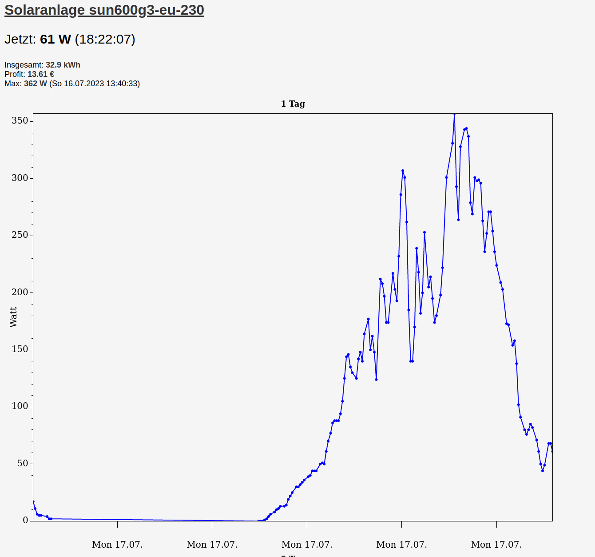
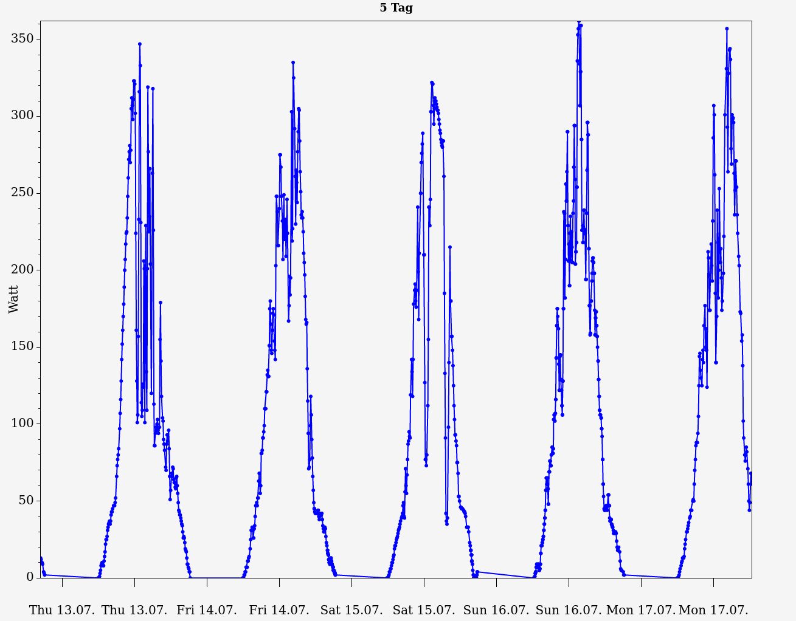

# Self hosted web service for sun600g3
Fetches output power from sun600g3-eu-230. Stores output in a MariaDB. Provides stored data over a web server.

Self hosted: No cloud or app required

## Requirements
- A running MariaDB server.
- .NET 7 runtime

# Usage
$ ./solar2 --help

```
Usage:
-d, --dbserver: Server address of MySQL database, e.g.: 127.0.0.1
-u, --dbuser: user for MySQL database, e.g.: user
-p, --dbpassword: password for database user, e.g. secret
-n, --interval: interval in minutes to fetch and store to DB, default: 5
-s, --solarhost: hostname to solar host, e.g.: 192.68.178.47
-v, --solaruser: username for solarhost, e.g.: admin
-x, --solarpassword: password for username for solarhost, e.g.: admin
-f, --logdir: log directory. if none is provied or not able to write, logs to console
```

- Update constant DataManager.PRICE_PER_KWH.
- Web service is accesible through port 5000 by default. You change it in the appsettings.json.

# Screenshots


